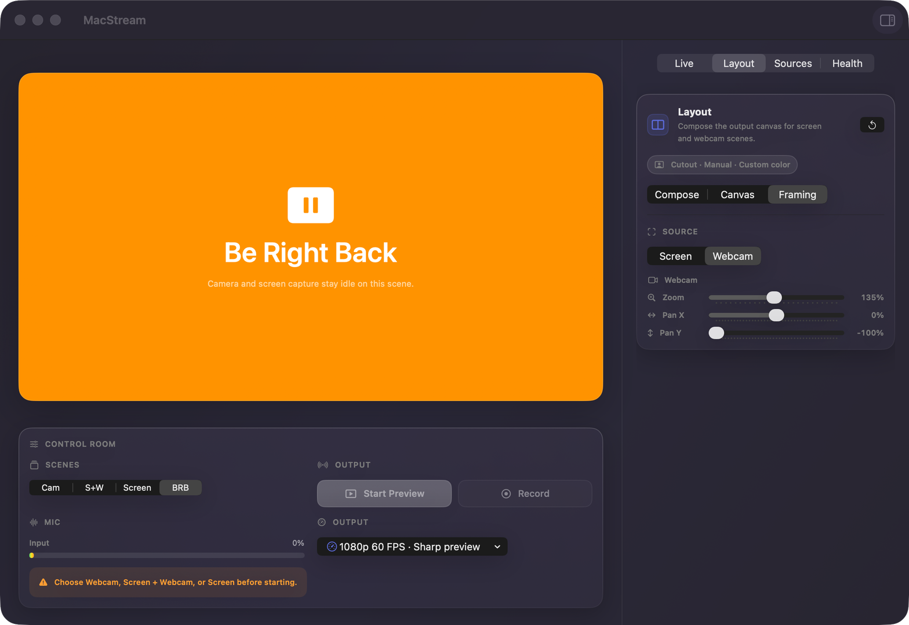

<div align="center">


# MacStream

### A native Apple Silicon studio for screen and webcam livestreams.




</div>

MacStream is a focused livestreaming app for solo creators on Apple Silicon.
It combines a display or window, webcam, microphone, and multiple RTMP
destinations in one native macOS workflow.

> **Project status:** MacStream is a personal-use prototype shared for testing.
> Validate important broadcasts with a private destination before relying on it
> in production.

## Install

Download the signed and notarized DMG from the
[latest GitHub Release](https://github.com/moinulmoin/macstream/releases/latest),
open it, and drag `MacStream.app` to `Applications`.

The DMG is the first-time installer. The ZIP published beside it is the signed
Sparkle payload used for in-app updates.

MacStream requires:

- an Apple Silicon Mac;
- macOS 26 or later;
- Camera, Microphone, and Screen Recording permission for the sources you use.

## Highlights

### Compose The Stream

- Webcam, Screen + Webcam, Screen, and BRB scenes.
- Display and individual-window capture through ScreenCaptureKit.
- Built-in, external, Continuity Camera, and Desk View discovery.
- Side-by-side 70/30, 50/50, and 30/70 layouts plus framed picture-in-picture.
- Native Vision presenter Cutout with left, right, top, bottom, and free placement.
- Direct canvas editing: select, drag, resize, zoom, pan, and reset screen or webcam content.
- Independent source framing, canvas padding, gap, corner radius, colors, and background images.
- Focused Compose, Canvas, and Framing inspector modes.

The setup preview, recording path, and RTMP publisher share the same composition
geometry. What appears in the program preview is the output MacStream records or
publishes.

### Publish And Record

- RTMP and RTMPS publishing in official release builds.
- Up to three simultaneous destinations from one composed output.
- Twitch, YouTube, Facebook, X, Kick, and custom ingest presets.
- Independent connection, queue, throughput, failure, and reconnect state per destination.
- Keychain-backed stream keys, redacted from the UI, logs, and exported reports.
- Optional record-while-streaming and standalone local `.mov` recording.
- Configurable output resolution, frame rate, preview quality, and performance mode.
- Signed Sparkle updates, notarized DMGs, and artifact checksums.

### Operate Long Sessions

- Permission, source, and destination preflight checks.
- Live microphone input metering.
- Automatic RTMP reconnect with downtime and recovery outcomes.
- A/V drift, dropped-frame, queue, throughput, and backpressure telemetry.
- Adaptive response to capture pressure, thermal state, memory pressure, and Low Power Mode.
- Redacted session reports and long-session CPU, memory, and thread-count tooling.
- Public native camera-effect status with access to Apple's Video Effects controls.

## Current Scope

| Area | Direction |
| --- | --- |
| Livestreaming | Primary product workflow |
| Recording | Optional local copy during or outside a stream |
| Multi-destination | Up to three independent RTMP/RTMPS targets |
| Video editing | Out of scope |
| AI and transcription | Deferred until the live core is proven |
| Native camera effects | Public status and Apple-owned controls only |
| Intel Macs | Not currently targeted |

MacStream is not a video editor and does not aim to reproduce every OBS feature.
The current priority is reliable capture, composition, publishing, recovery, and
long-session performance.

## Build From Source

Install Xcode with the macOS 26 SDK and Swift 6, then run from the repository root:

```bash
git clone https://github.com/moinulmoin/macstream.git
cd macstream

swift build
swift test
./script/build_and_run.sh
```

The packaged app is written to `dist/MacStream.app`.

### Build Variants

```bash
# Dependency-light development build.
swift build

# Real RTMP/RTMPS publishing.
MAC_STREAM_ENABLE_HAISHINKIT=1 swift build

# Experimental adapter compile check; not part of the live path.
MAC_STREAM_ENABLE_MLX=1 swift build

# Package an app and create a local DMG.
./script/package_macos_app.sh
./script/package_macos_dmg.sh
```

Official releases are built on GitHub Actions with HaishinKit enabled, Developer
ID signing, hardened runtime, Apple notarization, stapled tickets, Gatekeeper
validation, checksums, and Sparkle signatures.

## Architecture

```text
Sources/
  MacStream/           SwiftUI application and native preview adapters
  MacStreamCore/       Models, StudioStore, capture, composition, and publishing
Tests/
  MacStreamCoreTests/  Swift Testing suites and injected system fakes
Resources/             Info.plist, entitlements, icons, and bundled notices
script/                Build, packaging, release, and reliability tooling
```

Core constraints:

- `StudioStore` is the single `@MainActor @Observable` source of truth.
- `MediaPipeline` implementations own capture, recording, and publishing state.
- Sample-buffer hot paths avoid per-frame allocations and main-thread hops.
- Stream keys remain in Keychain and are redacted from every exported surface.
- Optional model output cannot control live switching or enter the capture hot path.

## Project Documents

- [Changelog](CHANGELOG.md)
- [v0.7.0 Release Notes](docs/releases/v0.7.0.md)
- [Current State](docs/current-state.md)
- [Architecture](docs/architecture.md)
- [QA Checklist](docs/qa-checklist.md)
- [Release Process](docs/releasing.md)
- [Contributing](CONTRIBUTING.md)
- [Third-Party Notices](THIRD_PARTY_NOTICES.md)

Issues and focused pull requests are welcome. Never include stream keys,
credentials, signing certificates, or generated build output.

## License

MacStream is free software licensed under the
[GNU Affero General Public License v3.0 only](LICENSE). Redistribution and
qualifying remote-network use of modified versions must follow its corresponding
source requirements.
